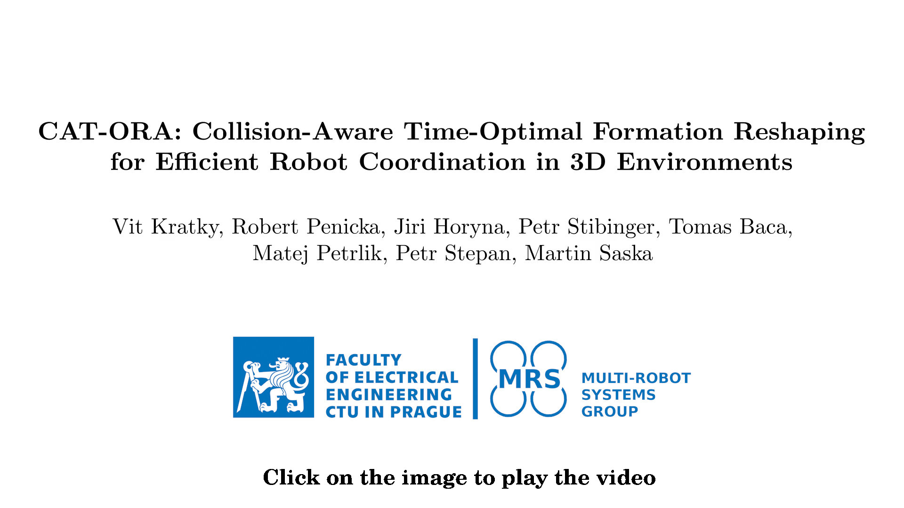

# CAT-ORA: Collision Aware Time-Optimal formation Reshaping Algorithm 
This repository contains the code for **Collision Aware Time-Optimal formation Reshaping Algorithm** presented in our [paper](https://arxiv.org/pdf/2412.00603).
[](https://youtu.be/FOCyGhxazMI?si=vV189B7v2TZ2ctoO)

## Code & How to
The code has been developed and tested on Ubuntu 20.04 with ROS noetic.

### Installation
1) Install prerequisities (`mrs_lib`):
```bash
  curl https://ctu-mrs.github.io/ppa-stable/add_ppa.sh | bash
  apt-get install ros-noetic-mrs-lib
```
2) Clone and build via `catkin`
```bash
  cd <ROS_WORKSPACE>/src
  git clone git@github.com:ctu-mrs/catora.git
  catkin build
```

### How to use
1) Use as nodelet and service servers:
```bash
roslaunch mrs_formation_reshaping catora.launch
```
A) Call service to obtain the CAT-ORA assignment 
  - start the nodelet
  - call service of type `mrs_formation_reshaping/SrvGetAssignment` with specified initial and final configurations on topic `/mrs_formation_reshaping/get_assignment` 
  - the response of the service includes the assignment represented as a single array X of length N where X[k] = m represents assignment of k-th element among initial configurations to m-th element in final configurations
  - example creation of the service request and calling the service from python script is provided in [scripts/call_get_assignment_srv.py](https://github.com/ctu-mrs/cat-ora/blob/master/scripts/call_get_assignment_srv.py) 
B) Call service to obtain the CAT-ORA set of reshaping trajectories
  - start the nodelet
  - call service of type `mrs_formation_reshaping/SrvGetReshapingTrajectories` with specified initial and final configurations, kinematic constraints and required dt on topic `/mrs_formation_reshaping/get_reshaping_trajectories`
  - the response of the service includes array of reshaping trajectories 
  - example creation of the service request and calling the service from python script is provided in [scripts/call_get_reshaping_trajectories_srv.py](https://github.com/ctu-mrs/cat-ora/blob/master/scripts/call_get_reshaping_trajectories_srv.py) 
2) Use as nodelet for offline generation of trajectories based on desired configurations loaded from files:
  - set parameter `formation_folder` to path to a folder containing files defining individual configurations 
  - specify list of files with desired configurations as parameter `formation_files` (format: `x y z`, example in [formations/letter_c_200.txt](https://github.com/ctu-mrs/cat-ora/blob/master/formations/letter_c_200.txt))
  - specify required kinematic constraints and trajectory discretization step as parameters `constraints/max_vel`, `constraints/max_acc`, `time_step`
  - if you want to save generated trajectories, set parameter `save_trajectories_to_file` to `true` and specify the target folder and filename as `trajectories_out_folder` and `trajectories_out_file` 
  - run the nodelet
```bash
roslaunch mrs_formation_reshaping catora.launch load_configurations:=true
```

2) Use as library in your code:
  - add `mrs_formation_reshaping` among dependencies in `CMakeLists.txt` and `package.xml` and include the `<mrs_formation_reshaping/formation_reshaper.h>` header file in your code
  - basic usage:
    ```cpp
    #include <mrs_formation_reshaping/formation_reshaper.h>
    ...
    // Initialize
    FormationReshaper formation_reshaper = FormationReshaper(maximmum_velocity, maximum_acceleration, trajectory_dt);
    ...
    // Use
    std::vector<Eigen::Vector3d> initial_configuration = ... ;
    std::vector<Eigen::Vector3d> final_configuration = ... ;
    std::vector<std::vector<Eigen::Vector3d>> trajectories = formation_reshaper_.getReshapingTrajectoriesCatora(initial_configuration, final_configuration);
    ```
  - **example usage**: `FormationReshapingNodelet` implemented in [src/formation_reshaping_nodelet.cpp](https://github.com/ctu-mrs/cat-ora/blob/master/src/formation_reshaping_nodelet.cpp)

### Additional performance and usage demonstration
1) Comparison of LSAP-based and CAT-ORA robot-to-goal assignment
```bash
roslaunch mrs_formation_reshaping catora.launch run_test:=true
``` 
  - the nodelet generates random instances of points in range (`testing/number_of_robots/min`, `testing/number_of_robots/max`) and area of dimensions specified by (`testing/area/horizontal_dimension`, `testing/area/vertical_dimension`) and applies original Hungarian algorithm with quadratic Euclidean costs (LSAP solution) and CAT-ORA algorithm to solve the instance
  - the initial and final configurations are visualized as green and red boxes, respectively, the assignments are represented as orange and blue lines for CAT-ORA and LSAP-based assignment respectively   
  - the next instance is generated every time a user input is provided in nodelet window

2) Call service to reshape visualized formation to desired configuration using CAT-ORA
  - start the nodelet
  - call service of type `mrs_formation_reshaping/SrvReshapeFormation` with specified final configuration, `/mrs_formation_reshaping/reshape_formation`
  - the computed trajectories will be applied to move the formation in the environment to desired configuration
  - example creation of the service request and calling the service from python script is provided in [scripts/call_formation_reshaping_request.py](https://github.com/ctu-mrs/cat-ora/blob/master/scripts/call_formation_reshaping_request.py) 

### RViz visualization   
The Rviz window with default configuration is run by default and can be disabled by providing argument `rviz:=false` to `catora.launch`. The RViz visualization can be started, stopped and reset using following commands: 

```bash
rosservice call /mrs_formation_reshaping/run_visualization 1
rosservice call /mrs_formation_reshaping/run_visualization 0
rosservice call /mrs_formation_reshaping/reset_visualization
``` 
  
## How to cite
If you use this code in an academic context, please cite the following publication:

V. Kratky, R. Penicka, J. Horyna, P. Stibinger, M. Petrlik, T. Baca, P. Stepan, and M. Saska, "CAT-ORA: Collision-Aware Time-Optimal Formation Reshaping for Efficient Robot Coordination in 3D Environments," in IEEE Transactions on Robotics, doi: 10.1109/TRO.2025.3547296. ([PDF](https://arxiv.org/pdf/2412.00603))

```
@ARTICLE{kratky2025catora,
  author={Kratky, Vit and Penicka, Robert and Horyna, Jiri and Stibinger, Petr and Baca, Tomas and Petrlik, Matej and Stepan, Petr and Saska, Martin},
  journal={IEEE Transactions on Robotics}, 
  title={CAT-ORA: Collision-Aware Time-Optimal Formation Reshaping for Efficient Robot Coordination in 3D Environments}, 
  year={2025},
  volume={},
  number={},
  pages={1-20},
  doi={10.1109/TRO.2025.3547296}
}
```

## License
GPL-3.0 License. Copyright (C) 2024 V. Kratky, R. Penicka, J. Horyna, P. Stibinger, M. Petrlik, T. Baca, P. Stepan, M. Saska (Faculty of Electrical Engineering, Czech Technical University in Prague).

This is a research code, expect that it changes often and any fitness for a particular purpose is disclaimed.
